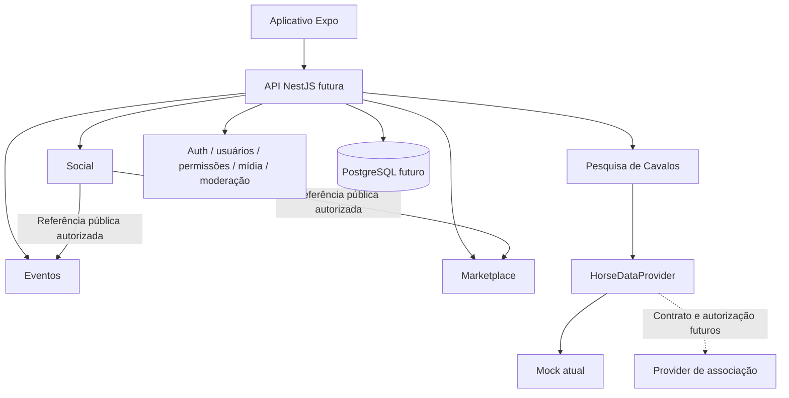

# Arquitetura

> Atualização de 24/09/2026: o escopo ativo é Portteira Marketplace. A criação local, o estado persistido, os adapters de associações e a recomendação estão descritos em [MARKETPLACE_UPDATE_2026-09-24.md](MARKETPLACE_UPDATE_2026-09-24.md). O restante deste documento registra a arquitetura da fundação anterior; as quatro frentes abaixo não representam a navegação atual.

Status: arquitetura inicial; implementação desta execução restrita ao cliente com mocks e contratos. Revisão: 17/09/2026.

## Inspeção inicial e limite do workspace

Antes da implementação, o diretório do projeto continha somente arquivos de configuração de ferramentas, sem aplicação, dependências ou backend existentes. Esses arquivos foram preservados. A inspeção inicial encontrou um repositório Git ancestral que incluía arquivos fora do aplicativo.

Em 02/10/2026, foi inicializado um repositório próprio na raiz do aplicativo para publicação no GitHub, sem alterar o repositório ancestral. Somente arquivos do aplicativo e de sua documentação entram na distribuição.

## Organização do repositório

Monorepo com npm workspaces. A separação inicial contém apenas unidades úteis agora:

```text
apps/
  mobile/
    src/app/           # Rotas Expo Router e layouts
    src/features/      # Social, events, marketplace, horse-database
    src/ui/            # Tokens, primitives e estados compartilhados
    src/components/    # Composições de UI compartilhadas
    src/providers/     # Safe areas e estado demonstrativo em memória
    src/config/        # Validação de configuração pública
    assets/            # Mídia ilustrativa local
packages/
  domain/
    src/               # Contratos, Zod, fixtures, filtros e provider mock
    tests/             # Testes de invariantes do domínio/provider
docs/                  # Produto, arquitetura, navegação, design e decisões
```

`apps/api`, migrations, storage e infraestrutura serão acrescentados quando o backend começar. Não há serviço vazio simulando uma implementação de produção. O suporte oficial do [Expo a monorepos](https://docs.expo.dev/guides/monorepos/) orienta a resolução dos pacotes; a configuração deve acompanhar a versão instalada, sem duplicar React/React Native entre workspaces.

## Cliente mobile

O Expo Router define rotas; telas compõem primitives e componentes de domínio. O tema central concentra tokens e componentes compartilhados. Estado de interface, como texto de busca e filtros locais, permanece próximo da tela. DTOs e validação de dados ficam em `packages/domain`; esse pacote não importa React, navegação, NestJS ou drivers de banco.

O cliente consome dados demonstrativos nesta execução. Ao introduzir uma API, adapters do cliente substituirão a origem local sem transferir autorização para a UI. Não adotar um estado global ou uma biblioteca de cache de servidor antes de haver necessidades de sincronização e persistência claras.

As quatro tabs são Social, Eventos, Mercado e Cavalos. “Mercado” é o rótulo compacto do Marketplace; “Cavalos” é apresentado como pesquisa independente. Detalhes ficam no stack raiz para que o mesmo evento ou anúncio possa abrir a partir de diferentes origens sem forçar troca de tab. Rotas de grupos e conversas permanecem planejadas. Ver [NAVIGATION.md](NAVIGATION.md).

O `AppProviders` atual reúne safe areas e pequenos conjuntos em memória para curtidas/salvamentos. Isso não é uma sessão de autenticação nem persistência. Listas usam `FlatList`; a tela de cavalos consulta o provider com cancelamento por `AbortSignal` e exibe loading, erro e vazio. O mock fornece paginação, mas a tela ainda carrega o conjunto demonstrativo em uma consulta limitada; não há feed remoto ou scroll infinito implementado.

### Configuração atual

`apps/mobile/.env.example` contém apenas `EXPO_PUBLIC_DATA_MODE=mock`. `src/config/env.ts` valida o valor com Zod antes de renderizar as rotas e assume `mock` quando ausente. Copiar o exemplo para `.env` é opcional para a execução local; qualquer modo diferente de `mock` é rejeitado. Não há URL de API, credenciais ou troca silenciosa para um ambiente de produção.

`app.json` usa o nome de trabalho Equestre, scheme de desenvolvimento `equestre-dev`, aparência clara e typed routes. Bundle identifier, package name definitivo, domínio, Universal Links/App Links e projeto de publicação continuam pendentes. Dependências nativas instaladas não equivalem a funcionalidades de câmera, push, vídeo ou realtime implementadas.

| Responsabilidade                            | Local                                          |
| ------------------------------------------- | ---------------------------------------------- |
| Caminhos e composição de navegação          | Rotas Expo Router                              |
| Layout, acessibilidade, feedback e tokens   | UI compartilhada do mobile                     |
| Tipos de eventos, posts, anúncios e cavalos | `packages/domain`                              |
| Consulta normalizada de cavalos             | Contrato `HorseDataProvider`                   |
| Fonte demonstrativa                         | Implementação mock explicitamente identificada |
| Autorização e persistência                  | Backend futuro                                 |

## Backend proposto

Node.js + TypeScript + NestJS, como monólito modular, com um PostgreSQL inicial. Cada módulo controla seus casos de uso, políticas, persistência e exports. Injeção de dependências é usada para adapters externos concretos, sem criar interfaces para toda função. O mecanismo de módulos do [NestJS](https://docs.nestjs.com/modules) fornece encapsulamento por imports/exports; os limites precisam também ser preservados por revisão e testes de arquitetura.



Não há aresta Social → Pesquisa de Cavalos. A composição de um post obtém um resumo de evento ou anúncio por contrato público do respectivo módulo, sem consultar seu repositório diretamente. Uma remoção ou restrição de acesso produz estado “conteúdo indisponível”; um snapshot não pode expor conteúdo que deixou de ser autorizado.

## Limites de domínio

| Módulo           | É proprietário de                                                | Pode consumir                                                         |
| ---------------- | ---------------------------------------------------------------- | --------------------------------------------------------------------- |
| `social`         | Posts, comentários, interações, seguidores, comunidades públicas | Perfis, mídia, moderação e referências a eventos/anúncios             |
| `events`         | Cadastro, organização e descoberta de eventos                    | Perfis/organizações, mídia, localização, permissões                   |
| `marketplace`    | Anúncios, atributos de categoria, favoritos e contato autorizado | Perfis/organizações, mídia, localização, moderação                    |
| `horse-database` | Normalização, procedência e consultas a providers                | Mecanismos autorizados das fontes e cache condicionado à licença      |
| `messaging`      | Conversas diretas, grupos privados, convites e mensagens         | Participantes, mídia privada, moderação e referências compartilháveis |

Serviços compartilhados planejados: `auth`, `users`, `profiles`, `media`, `notifications`, `moderation`, `search`, `location`, `analytics` e `permissions`. “Compartilhado” não significa repositório universal. Busca começa consultando o módulo correspondente; analytics não terá SDK ou coleta no shell.

Permissões têm contexto de recurso. Administrador de uma comunidade não é administrador da plataforma; administrador de um grupo privado não recebe acesso a outras conversas. Operações que envolvam mais de uma entidade no monólito usam transação e coordenação explícita. Eventos internos assíncronos e outbox só entram quando existir entrega externa ou tarefa durável que justifique a complexidade.

## Persistência e escolha do ORM

**Drizzle é a escolha arquitetural para a fase de backend; não é instalado nem usado nesta execução.** Seu modelo próximo de SQL é adequado às consultas de filtros, índices e autorização por recurso esperadas. As [APIs de constraints e índices](https://orm.drizzle.team/docs/indexes-constraints) e as [migrations SQL versionadas](https://orm.drizzle.team/docs/migrations) permitem revisar o que será aplicado ao PostgreSQL.

| Critério                 | Prisma                                                    | Drizzle                                                 |
| ------------------------ | --------------------------------------------------------- | ------------------------------------------------------- |
| Modelo de trabalho       | Schema e cliente próprios, com boa descoberta de relações | Schema TypeScript e consultas próximas de SQL           |
| Migrations               | Fluxo próprio de geração/revisão                          | Geração de SQL com revisão explícita                    |
| Consultas especializadas | Pode exigir SQL adicional conforme recurso/versão         | SQL faz parte do fluxo de composição                    |
| Custo para a equipe      | Conveniência em CRUD e relações                           | Mais responsabilidade sobre SQL e desenho das consultas |

A escolha é de adequação ao projeto, não uma alegação de superioridade universal. Prisma suporta múltiplos tipos de índices e possui recursos para índices parciais; disponibilidade e estabilidade dependem da versão. A [documentação atual de índices do Prisma](https://docs.prisma.io/docs/orm/prisma-schema/data-model/indexes) deve ser revista junto da versão escolhida antes de implementar. Ambos permitem acesso inseguro se o código ignorar autorização. O ORM não é um mecanismo de permissões.

Migrations futuras terão revisão, testes em banco descartável, backup/restauração ensaiados e estratégia de expansão/migração/contração para mudanças incompatíveis. Não usar sincronização automática de schema em produção. Ver [DATA_MODEL.md](DATA_MODEL.md).

## Estratégia de providers

`HorseDataProvider` é uma porta do domínio, inicialmente implementada por um mock. Futuras implementações `ABCCMMProvider`, `ABQMProvider` e `ABCCAProvider` só existirão após confirmar acesso e direitos. Não há classes vazias com nomes oficiais sugerindo parceria ativa.

O adapter traduz identificação, códigos de raça, sexo, datas, parentesco e resultados para o contrato comum. Identidade externa é o par fonte + identificador externo; um nome ou número de registro isolado não é chave universal. Informações não fornecidas pela fonte permanecem desconhecidas.

O desenho futuro deve suportar capacidades por fonte, paginação, cancelamento, timeout, limites de consulta, erro recuperável e procedência por dado. Cache, retenção, atribuição, consulta de proprietário e redistribuição dependem da licença. Não juntar animais de fontes distintas por aproximação de nomes. O contrato executável atual é a fonte de verdade para os métodos já disponíveis; extensões entram apenas com caso de uso real.

## Mídia, realtime e infraestrutura futura

`MediaStorage` já tem uma porta TypeScript para upload/consulta/remoção, sem implementação. Um adapter S3, R2 ou equivalente será escolhido após requisitos de custo e região. Upload privado requer autorização antes de emitir URL temporária. Um serviço especializado poderá processar vídeos; o modelo manterá estados de processamento e variantes sem atrelar o domínio a fornecedor. O shell não envia arquivos nem busca mídia privada.

Mensagens futuras usarão transporte realtime autenticado, por WebSocket ou equivalente, com persistência como fonte de verdade, IDs para deduplicação e reconexão por cursor. Redis só entra quando houver necessidade de distribuição entre instâncias, filas ou rate limiting compartilhado. Notificações push considerarão Expo Notifications, APNs e FCM na fase própria.

Busca começa com PostgreSQL, índices orientados às consultas e paginação. Extensões de texto/geografia e mecanismos especializados exigirão medição e necessidade concreta. Nenhuma infraestrutura de Kubernetes, microservices, busca externa ou filas é provisionada agora.

## Performance e operação

- Usar listas virtualizadas, chaves estáveis, imagens dimensionadas e paginação para conteúdo crescente.
- Carregar primeiro texto e miniaturas; mídia de vídeo só quando necessária. Não iniciar múltiplos players fora de tela.
- Introduzir cache de servidor e mutations otimistas por caso de uso, com rollback e reconciliação.
- Manter UI utilizável com latência, falha, coleção vazia e permissão negada.
- Medir tempo de início, uso de memória, scroll e tamanho do bundle em builds de desenvolvimento nativas antes de definir orçamento final.
- No backend, medir latência por endpoint, erros, queries lentas e tarefas pendentes, sem registrar mensagens privadas ou tokens.

TypeScript strict, lint, formatter, validação runtime e testes de regras compõem a fundação. Testes nativos, de API, autorização, migrations e recuperação entram junto às respectivas implementações. Uma exportação web bem-sucedida não equivale a validação completa em iOS e Android.

Fontes técnicas consultadas em 16/09/2026. Revisar versões e compatibilidades novamente ao iniciar o backend ou atualizar o SDK.
