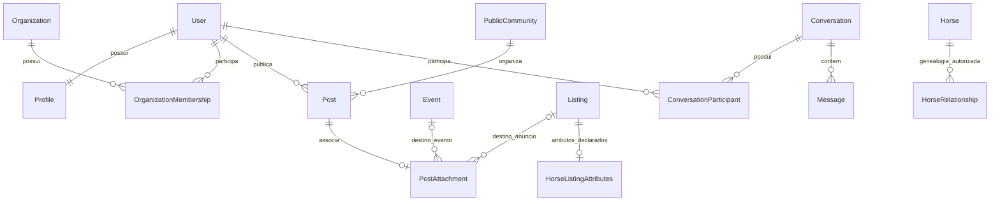

# Modelo de dados conceitual

> Atualização de 24/09/2026: o domínio ativo acrescenta `MarketplaceListing`, `NewListingInput`, `MarketplaceState`, `HorseVerification`, evidências de selos e preferências/eventos de recomendação. Anúncios locais guardam declarações de nome, associação e registro, sem persistir selos confiados ao cliente. Veja [MARKETPLACE_UPDATE_2026-09-24.md](MARKETPLACE_UPDATE_2026-09-24.md). As seções abaixo documentam a fundação anterior e o modelo conceitual de backend, ainda não implementado.

Status: desenho para evolução. Revisão: 17/09/2026. Não há banco nem migrations nesta execução. Os contratos TypeScript do shell são subconjuntos de leitura; este documento não afirma que todas as entidades abaixo já existem em código.

## Convenções

- IDs internos são opacos; não derivar autorização ou identidade de nomes, emails, slugs ou números de registro. UUID é a proposta para persistência futura.
- Timestamps são instantes UTC; eventos preservam também o fuso IANA do local. Data de nascimento é data civil, sem conversão de fuso.
- Preços usam valor inteiro na menor unidade monetária e moeda explícita. Valor desconhecido/sob consulta é distinto de zero; operações financeiras não fazem parte do escopo.
- Campos obrigatórios, opcionais e desconhecidos são definidos por contrato. Não preencher dados faltantes com zeros, strings vazias ou valores “prováveis”.
- A interface usa rótulos em português; chaves de domínio têm nomenclatura consistente e independente do texto visual.
- Exclusão lógica não equivale a eliminação de dados pessoais. Retenção e remoção física terão políticas específicas.

## Identidade, perfis e organizações

| Entidade                 | Campos e relações principais                                                              | Regra                                                                   |
| ------------------------ | ----------------------------------------------------------------------------------------- | ----------------------------------------------------------------------- |
| `User`                   | id, credenciais/referência de identidade, estado, timestamps                              | Conta individual; dados de autenticação nunca integram perfil público   |
| `Profile`                | id, userId único, nome público, biografia, avatar, localidade, classificação profissional | Uma identidade pública por usuário na configuração inicial              |
| `ProfessionalProfile`    | profileId único, especialidades e informações profissionais                               | Extensão opcional; não concede privilégios                              |
| `Organization`           | id, nome, tipo, descrição, mídia, localidade                                              | Haras e organizações de criadores/eventos podem ter vários responsáveis |
| `OrganizationMembership` | organizationId, userId, papel, estado                                                     | Permissões limitadas à organização                                      |
| `RoleAssignment`         | userId, papel, contexto do recurso                                                        | Administração global separada de papéis locais                          |
| `Session`                | id, userId, hash do refresh token, expiração, revogação, família de rotação               | Não guardar refresh token em texto puro                                 |

“Criador”, “profissional” e “organizador” descrevem atuação; “administrador” é uma permissão. Evitar tabelas de usuários separadas por categoria. Publicações e anúncios sempre mantêm o ator responsável, mesmo quando exibidos em nome de organização.

## Social e comunidades públicas

| Entidade              | Relações / atributos essenciais                                                                |
| --------------------- | ---------------------------------------------------------------------------------------------- |
| `Post`                | autor, organização opcional, comunidade pública opcional, texto, mídia ordenada, estado, datas |
| `PostAttachment`      | postId único e exatamente uma referência a `Event` ou `Listing`                                |
| `Comment`             | postId, autor, texto, parentCommentId opcional, estado, datas                                  |
| `PostLike`            | par único userId + postId                                                                      |
| `PostSave`            | par único userId + postId; lista privada do usuário                                            |
| `Follow`              | followerProfileId + followedProfileId únicos; impedir autofollow                               |
| `PublicCommunity`     | nome, descrição, imagem, capa, regras, estado, criador                                         |
| `CommunityMembership` | comunidade, usuário, papel local, estado de participação                                       |

O DTO da associação de post é uma união discriminada `event | listing`. Não existe variante `horse`. Na persistência futura, preferir duas FKs opcionais com constraint de exclusividade a um par genérico `type + targetId` sem integridade referencial. O post pode ter nenhuma associação. Referências a entidades removidas precisam renderizar indisponibilidade sem quebrar a publicação.

Comentários encadeados terão profundidade limitada definida antes da implementação. Contagens de curtidas/seguidores podem ser projeções; as relações são a fonte de verdade. Aprovação de membros/posts em comunidades públicas é extensão futura, sem reaproveitar estados de convites privados.

## Eventos

`Event`: id, título, descrição, tipo, organizador/organização, responsável, estado, início, fim opcional, fuso, local, endereço, cidade, estado, região, coordenadas opcionais, raças, modalidade, regulamento, mídia e links externos.

Invariantes planejadas: fim posterior ao início quando informado; coordenadas válidas; links permitidos e identificados; apenas responsável ou membro autorizado da organização pode editar. Organizadores não são automaticamente verificados. Tipos de evento e modalidades serão vocabulários controlados de produto, sem inventar taxonomias definitivas nesta fase.

Índices candidatos: estado de publicação + início + id; cidade/estado + início; raça + início. Índices finais serão escolhidos a partir de consultas e planos de execução. Distância exigirá decisão de representação geográfica e privacidade antes de uso real.

## Marketplace

| Entidade                 | Campos e relações                                                                                                                                                                                                                  |
| ------------------------ | ---------------------------------------------------------------------------------------------------------------------------------------------------------------------------------------------------------------------------------- |
| `Listing`                | categoria, título, descrição, valor/moeda ou sob consulta, anunciante, localidade, contato autorizado, estado, mídia, datas                                                                                                        |
| `HorseListingAttributes` | listingId único, raça, sexo, nascimento ou idade aproximada com referência temporal, pelagem, pai/mãe declarados, linhagem, criador, haras, registro declarado, modalidades, títulos, premiações, disponibilidade, características |
| `ListingFavorite`        | userId + listingId únicos                                                                                                                                                                                                          |

Uma linha de atributos equinos existe somente para categoria cavalo. Atributos de equipamentos/produtos/serviços entram conforme os formulários desses casos de uso, sem um campo JSON universal para todas as regras. Preço não negativo; limites mínimo/máximo coerentes; nascimento não futuro.

Pai, mãe, registro e proprietário declarados no anúncio **não são FKs para a Pesquisa de Cavalos**. Uma eventual vinculação verificada requer nova decisão e não está no escopo atual.

Estados propostos: rascunho, ativo, pausado, encerrado e removido; nomes definitivos serão alinhados aos fluxos. Contato e publicação exigem validação de permissões. Índices candidatos: categoria/estado/data/id; raça/localidade/valor quando aplicável. Evitar indexar todas as combinações antecipadamente.

## Pesquisa de Cavalos

`Horse` é uma visão normalizada de pesquisa, não um novo registro oficial. Campos conceituais:

| Grupo        | Dados                                                                              |
| ------------ | ---------------------------------------------------------------------------------- |
| Identidade   | id interno, externalSource, externalId, registryNumber, name, breed                |
| Cadastro     | sex, birthDate, coat                                                               |
| Parentesco   | sire, dam, lineage, referências a ancestrais e descendentes                        |
| Responsáveis | breeder, owner somente quando permitido                                            |
| Desempenho   | awards, results, histórico competitivo                                             |
| Procedência  | sourceLabel, momento de consulta, referência da fonte, condições e disponibilidade |

O par `externalSource + externalId` é único dentro da integração. Números de registro e nomes não são necessariamente globais. Mesmo nome não implica mesmo animal; não deduplicar entre associações sem regra autorizada e evidência.

Uma referência de ancestral pode ter apenas nome e registro, sem ficha acessível. Modelar explicitamente `conhecido`, `não informado` e `indisponível` na evolução dos contratos evita inferir parentesco. A genealogia é um grafo direcionado; validar ciclos e limitar profundidade, fan-out e quantidade de nós em consultas futuras. Avós e bisavós derivam de relações confirmadas, não de colunas rígidas multiplicadas na tabela principal.

`HorseRelationship`, `HorseResult`, `HorseAward` e `SourceProvenance` são conceitos previstos; a necessidade de armazená-los localmente depende dos direitos de cache/importação da fonte. Caso autorizado, preservar fonte e atualização para cada relação/resultado. Uma tabela futura de cache não muda a titularidade dos dados nem permite redistribuição fora da licença.

O provider mock usa exclusivamente registros demonstrativos. Nem `ABCCMMProvider`, `ABQMProvider`, `ABCCAProvider` nem tabelas de espelhamento oficial estão implementados.

## Conversas e grupos privados

| Entidade                  | Regra                                                                              |
| ------------------------- | ---------------------------------------------------------------------------------- |
| `Conversation`            | Tipo direta ou grupo privado, estado, criação                                      |
| `ConversationParticipant` | Conversa, usuário, papel, entrada/saída, leitura e estado                          |
| `PrivateGroupDetails`     | Nome, imagem, regras administrativas do grupo privado                              |
| `ConversationInvite`      | Convite com expiração, estado, emissor e destinatário/contexto autorizado          |
| `Message`                 | Conversa, remetente participante, texto/mídia/referência interna, sequência, datas |

Não há FK de `PublicCommunity` determinando acesso a mensagens privadas. Mensagens compartilhadas só permitem referências internas autorizadas, incluindo evento e anúncio; o conteúdo não pode conceder acesso por si só. Convites são tokens não enumeráveis, armazenados por hash e revogáveis. Histórico após saída, entrada e bloqueio precisa de política antes da fase 11.

## Mídia, moderação e notificações

`MediaAsset`: proprietário, finalidade, chave de storage, visibilidade, MIME detectado, tamanho, dimensões/duração, estado de processamento, variantes e retenção. Relações de conteúdo preservam ordem de apresentação. URLs temporárias não são a identidade persistente da mídia.

`Report`: denunciante, alvo tipado, motivo, evidência permitida, estado e timestamps. Alvos incluem usuário, post, comentário, comunidade, mensagem apropriada e anúncio. `ModerationAction` registra ator autorizado, ação, motivo e alvo; `AdminAuditLog` mantém eventos administrativos com acesso restrito e política de retenção.

`UserBlock` e `UserMute` são relações dirigidas distintas; bloqueio impacta acesso/interação, silêncio é preferência de apresentação. `Notification` e `PushInstallation` serão privados por usuário e terão conteúdo mínimo. Nenhuma dessas entidades opera no shell.

## Diagrama de relações centrais

O diagrama é conceitual e não representa cardinalidades completas de moderação/mídia. Cada `PostAttachment` tem exatamente um dos dois destinos; essa exclusividade será garantida por constraint no backend. `Horse` permanece separado das relações sociais e de anúncios.
